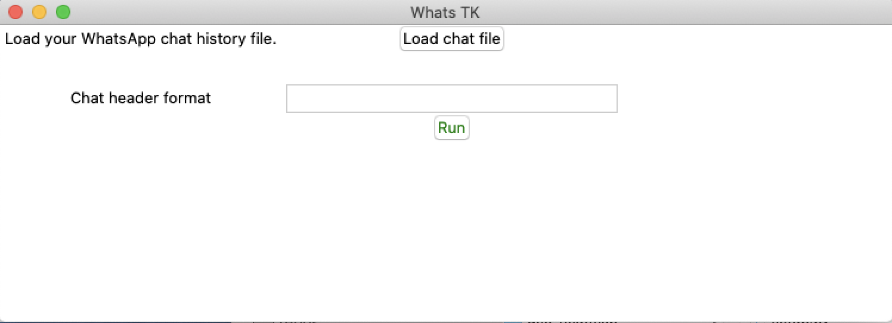
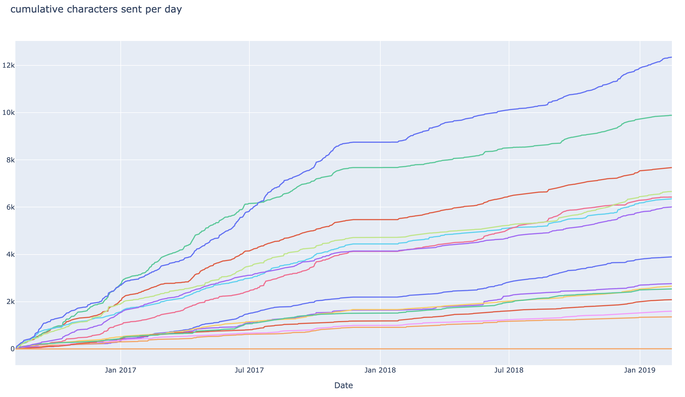

# Analyze your WhatsApp chats
**[versión en español](esp.md)**

Use *WhatsTK* to analyse your WhatsApp chats. **Currently it is only available for mac OS.**

<!-- <p style="text-align: center;"> -->
<div style="margin: 0 auto;">
<table class="tg">
    <tr>
        <th class="tg-fymr" colspan="2">Downloads</th>
    </tr>
    <tr>
        <td class="tg-0pky">macOS (Catalina)</td>
    <td class="tg-0pky"><a href="dist/WhatsTK.zip"></a>
    </td>
    </tr>
</table>
</div>
<!-- </p> -->

## How to use

1. UnZip the downloaded file.
2. Start the program (double click on the file)
3. Once the Software is loaded (might take few seconds), click on _Load chat file_ to select file.

<p style="text-align: center;">

</p>
<br>

4. Write down the header format of your whatsapp chat file. For instance `%d.%m.%y, %H:%M - %name:` (check more on
   `headers` section below).
5. Click on `Run`.

<br>

Below an example of the results

<br>
<p style="text-align: center;">

</p>
<br>

---
## FAQs

* **How can I get the chat of a WhatsApp chat?**

    Open the WhatsApp chat you want to analyze on your mobile phone. Click on _More_, then click on _Export chat_ and
    choose _Without media_. Wait few seconds until the chat export file has been created and save it (recommended: send t via mail to yourself so it is available on your computer).


* **App icon shows on Dock, disappears and then appears again.**

    This is the normal behaviour. Wait until it loads.

* **Which is the header of my chat?**

    Open the exported chat file. You will find that the messages have a similar format:

    ```
    15.04.2016, 15:04 - You created group “Sample Group”
    06.08.2016, 13:18 - Messages you send to this group are now secured with end-to-end encryption. Tap for more info.
    06.08.2016, 13:23 - Ash Ketchum: Hey guys!
    06.08.2016, 13:25 - Brock: Hey Ash, good to have a common group!
    06.08.2016, 13:30 - Misty: Hey guys! Long time haven't heard anything from you
    06.08.2016, 13:45 - Ash Ketchum: Indeed. I think having a whatsapp group nowadays is a good idea
    06.08.2016, 14:30 - Misty: Definetly
    06.08.2016, 17:25 - Brock: I totally agree
    07.08.2016, 11:45 - Prof. Oak: Kids, shall I design a smart poke-ball?
    ```

    In this example, the header is "DAY.MONTH.YEAR, HOUR:MINUTES - USERNAME:", which corresponds to a header format code
    is: `%d.%m.%Y, %H:%M -- %name:`.
    
    | Unit Code | Definition               |
    |-----------|--------------------------|
    | %y        | Year                     |
    | %m        | Month of the year (1-12) |
    | %d        | Day of the month (0-31)  |
    | %H        | Hour 24h-clock (0-23)    |
    | %P        | Hour 12h-clock (1-12)    |
    | %M        | Minutes (0-60)           |
    | %name     | Name of user             |

* **I am an experimented coder. Where can I access to the code?**

    Check python library [whatstk](https://lcsrg.me/whatstk).

---

*This library uses [whatstk](https://lcsrg.me/whatstk) python library.*