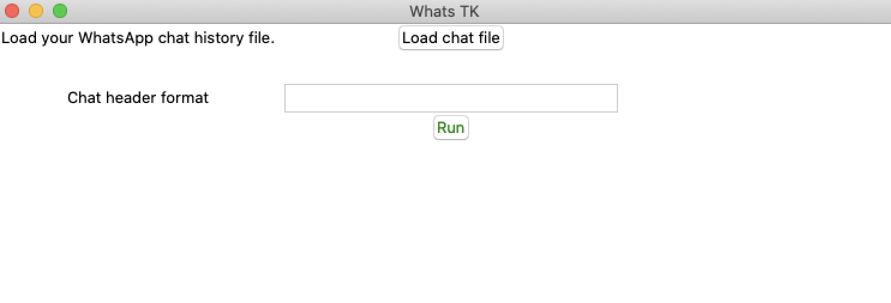

# Analyze your WhatsApp chats
**[versión en español](esp.md)**

Use *WhatsTK* to analyse your WhatsApp chats. **Currently it is only available for Mac OS**

 
 

 

## Downloads

<view style="display: flex, justify-content: center">
    <table class="tg">
    <tr>
        <th class="tg-fymr" colspan="2">Downloads</th>
    </tr>
    <tr>
        <td class="tg-0pky">macOS (Catalina)</td>
    <td class="tg-0pky">
    </td>
    </tr>
    </table>
</view>

## How to use
1. UnZip the downloaded file.
2. Start the program (double click on the file)
3. Once the Software is loadewd (might take few seconds), click on _Load chat file_ to select file.
4. Write down the header format of your whatsapp chat file. For instance `%d.%m.%y, %H:%M - %name:` (check more on
   `headers` section below).
5. Click on `Run`.

Below an example of the results

---
## FAQs

* **App icon shows on Dock, disappears and then appears again.**

    This is the normal behaviour. Wait until it loads.

* **How can I get the chat of a WhatsApp chat?**

    Open your Whatsapp

    
---

*This library uses [whatstk](https://lcsrg.me/whatstk) python library.*