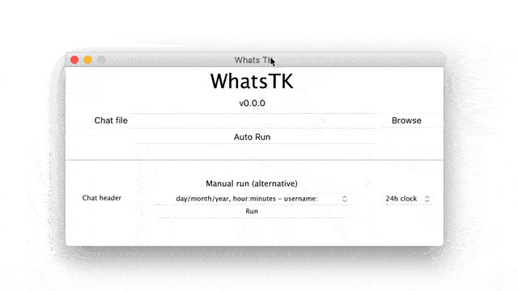
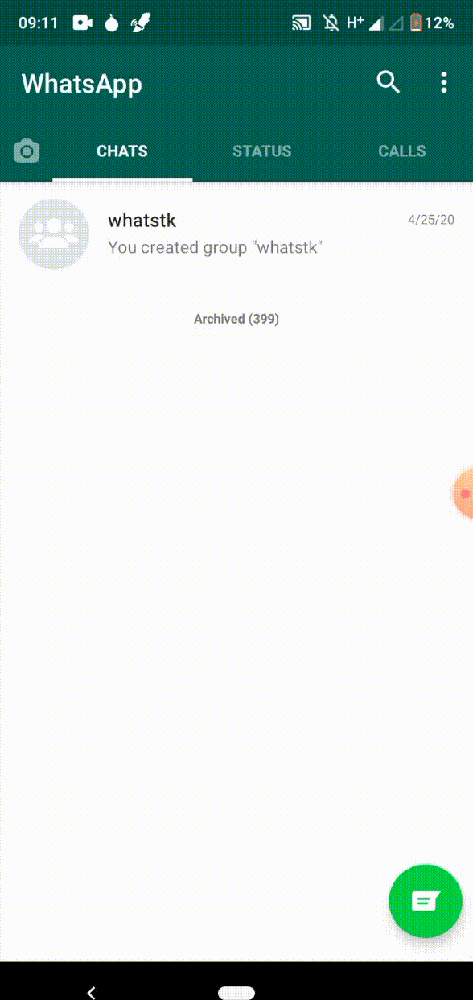
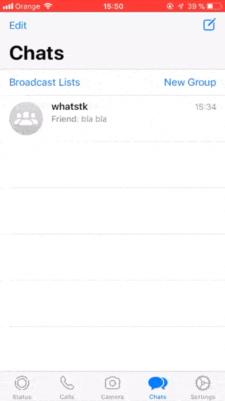

<head>
 <link rel="shortcut icon" type="image/x-icon" href="favicon.ico">
</head>

# Analyze your WhatsApp chats (beta version)


<!-- [](pages/esp.md) -->

Use **WhatsTK** to analyse your WhatsApp chats. Currently it is **only available for mac OS**.

<br>

<table class="tg" style="display: flex; justify-content: center; width: 100%;">
    <tr>
        <th class="tg-fymr" colspan="2">Downloads</th>
    </tr>
    <tr>
        <td class="tg-0pky">macOS (10.13 and above)</td>
    <td class="tg-0pky"><a href="releases/v0.0.0/WhatsTK-v0.0.0-macOS-10.13-Installer.dmg"></a>
    </td>
    </tr>
</table>
<br>

## How do I use it?

1. Start the program (double click on the Application).
2. Load your chat as a text file (see FAQs section on how to obtain it).
3. Try `Auto Run`. If it does not work, check Manual Run options.

<br>

The results are given in `HTML` format, so the graphs are interactive. 

<br>
<p style="text-align: center;">

</p>
<br>

---
## FAQs

* **How can I export a WhatsApp chat as a file?**

    Exporting the WhatsApp chat can be easily done from your iOS or Android device. Check the _gifs_ below to see the instructions. When exporting, make sure to select the chats _Without Media_ option. Once generated, you can send it via mail, so you can save it in your computer.
    
    On **Android**, several files might be exported. We are only interested in the text file (i.e. `txt` extension file).
    
    On **iOS**, the chat is exported as a `zip`. Once on your computer, unzip it to obtain the `txt`.

<br>

<!-- border:1px solid yellow; -->

<div style="display: flex;">

  <div style="display: flex; flex-direction: column; flex: 1; align-items: stretch; justify-content: space-between;">
    <div style="flex:10; display: flex; justify-content: center; align-items: center; padding: 0px 20px;">
      
    </div>
    <div style="flex:1; display:flex; justify-content: flex-end; flex-direction: column; align-items: center; padding-top: 20px;">
      <span style="text-align: center; font-style: italic;">Android 9, WhatsApp 2.20.123</span>
    </div>
  </div>

  <div style="display: flex; flex-direction: column; flex: 1; align-items: stretch; justify-content: space-between; ">
    <div style="flex:10; display: flex; justify-content: center; align-items: center; padding: 0px 20px;">
      
    </div>
    <div style="flex:1; display:flex; justify-content: flex-end; flex-direction: column;  align-items: center; padding-top: 20px;">
      <span style="text-align: center; font-style: italic;">iOS 12, WhatsApp 2.20.31</span>
    </div>
  </div>
  
</div>

<br>

* **App icon shows on Dock, disappears and then appears again.**

    This is the normal behaviour. Wait until it loads.

* **Auto Run or Manual Run?**

    Auto Run tries to automatically detect the header used in your chat file, which can be different between devices and countries.

    If it does not work, try the `Manual Run` by selecting the appropriate header format from the dropdown menu.

* **What is the so called _header format_?**
    The chat file syntax can differ between devices, OS and language settings, which makes it hard some times to
    correctly parse the data and make WhatsTK work correctly.

    The _header_ appears for each message sent in the chat. It contains a timestamp and the name of the user that sent the message.
    
    See it for yourself and open the exported chat file. You will find that the messages have a similar format like the
    one below:

    ```
    15.04.2016, 15:04 - You created group “Sample Group”
    06.08.2016, 13:18 - Messages you send to this group are now secured with end-to-end encryption. Tap for more info.
    06.08.2016, 13:23 - Ash Ketchum: Hey guys!
    06.08.2016, 13:25 - Brock: Hey Ash, good to have a common group!
    06.08.2016, 13:30 - Misty: Hey guys! Long time haven't heard anything from you
    06.08.2016, 13:45 - Ash Ketchum: Indeed. I think having a whatsapp group nowadays is a good idea
    06.08.2016, 14:30 - Misty: Definetly
    06.08.2016, 17:25 - Brock: I totally agree
    07.08.2016, 11:45 - Prof. Oak: Kids, shall I design a smart poke-ball?
    ```

    In this example, the header is `day.month.year, hour:minutes - username:`. However, in your case it may be something
    else like `[year/month/day hour:minutes:seconds] username:`
    

* **I am an experimented coder. Where can I access to the code?**

    Check python library [whatstk](https://lcsrg.me/whatstk).

<br>

**Not resolved? Ask your question [here](https://github.com/lucasrodes/whatstk-gui/issues)!**

<br>

---

*This library uses [whatstk](https://lcsrg.me/whatstk) python library.*